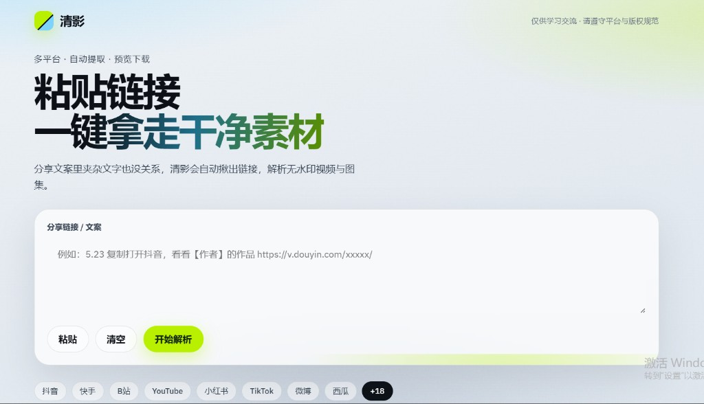

<div align="center">

# QuShuiYin · 清影

**一键解析多平台无水印视频与图集**

粘贴分享口令 → 自动抽链 → 在线预览 → 保存到本地

[](LICENSE)
[](backend/requirements.txt)
[](frontend/package.json)

</div>

---

## 📸 界面展示

<table>
  <tr>
    <td width="50%">
      
      <p align="center"><b>首页</b> — 粘贴链接，一键解析</p>
    </td>
    <td width="50%">
      
      <p align="center"><b>解析结果</b> — 视频预览，保存到本地</p>
    </td>
  </tr>
</table>

---

## ✨ 功能

| 功能 | 说明 |
|------|------|
| 智能抽链 | 分享文案里夹杂文字也能自动识别 URL |
| 多平台 | 抖音 · 快手 · B 站 · YouTube · 小红书 · TikTok · 微博 · 西瓜 等 |
| 在线预览 | 视频 / 图集 / 实况 / 音频 |
| 代理下载 | 服务端代理，缓解防盗链与跨域 |
| 现代 UI | 简洁交互，支持粘贴、清空、一键解析 |

## 🚀 快速开始

### 本地运行

```bash
# 后端（8051）
cd backend && pip install -r requirements.txt && python app.py

# 前端（5173）— 新开一个终端
cd frontend && npm install && npm run dev
```

浏览器打开 **http://localhost:5173** · Windows 可双击 `start.bat`

### 免费上线

| 组件 | 平台 | 说明 |
|------|------|------|
| 后端 API | [Render](https://render.com) | Root: `backend` |
| 前端网页 | [Cloudflare Pages](https://pages.cloudflare.com) | Root: `frontend`，框架选 **无** |

前端环境变量（必填）：

```text
VITE_API_BASE=https://你的render后端.onrender.com
```

详细步骤 → **[DEPLOY.md](./DEPLOY.md)**

---

## 🛠️ 技术栈

| 模块 | 技术 |
|------|------|
| 前端 | Vite · React · TypeScript · Framer Motion |
| 后端 | Flask · Gunicorn · 多平台 Parser 工厂 |

## ⚙️ 环境变量

复制 `backend/.env.example` → `backend/.env`：

```env
SECRET_KEY=随机字符串
XIAOHONGSHU_COOKIE=a1=xxx; webId=xxx; web_session=xxx
```

> 小红书 Cookie 用 **Header String** 格式（不是 JSON），从浏览器 F12 → 网络 → 请求头复制 `Cookie:` 后面的整段。

## 📁 项目结构

```text
QuShuiYin/
├── frontend/          # React 前端
├── backend/           # Flask 解析 API
│   ├── src/parsers/   # 各平台解析器
│   └── src/api/       # parse / stream / download
├── docs/              # README 截图等资源
├── DEPLOY.md          # 部署指南
└── NOTICE.md          # 第三方致谢
```

## 🔌 API

| 方法 | 路径 | 说明 |
|------|------|------|
| POST | `/api/parse` | 解析分享链接 |
| GET | `/api/stream` | 媒体预览代理 |
| GET | `/api/download` | 媒体下载代理 |

## ❓ 常见问题

| 问题 | 解决办法 |
|------|----------|
| 网页能开，解析失败 | 检查 `VITE_API_BASE`，改后需重新部署前端 |
| Render 第一次很慢 | 免费实例会休眠，等 30～60 秒 |
| 小红书失败 | 用带 `xsec_token` 的完整链接，或配置 Cookie |
| Cloudflare 没有 Vite | 框架选「无」，构建 `npm install && npm run build`，输出 `dist` |

## ⚠️ 免责声明

本项目**仅供学习交流**，请遵守各平台服务条款与版权法规，勿用于侵权或商用。  
后端解析引擎衍生自开源项目，详见 [NOTICE.md](./NOTICE.md)。

## 📄 License

[MIT](LICENSE)
